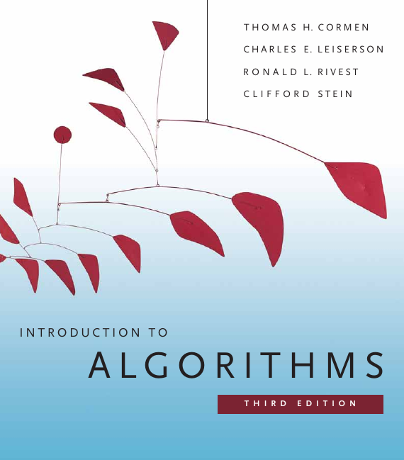
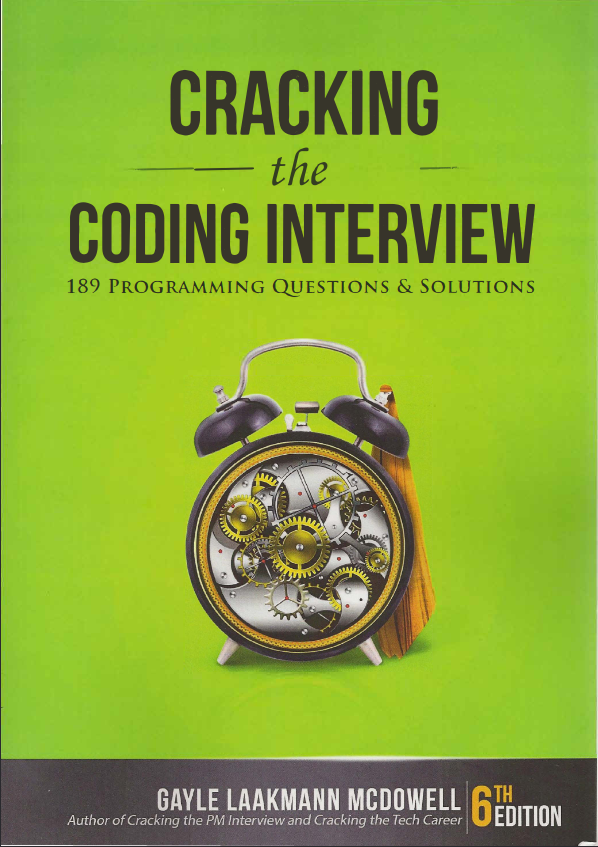

Hello, it's AmigosKazz ;)

These are the books proposed by *Luco Ramaromanana* when sharing on `ROADMAP POUR DEVENIR PROGRAMMEUR DANS LES STUDIOS DE JEUX AAA`, to prepare for being hired.

##### Books :

- **Introduction to ALGORITHMS** by *THOMAS H.Cormen, CHARLES E. Leiserson, RONALD L. Rivest and CLIFFORD Stein*

   
  
- **Cracking the coding interview** by *Gayle Laakmann MCDOWELL*

 
 
 

##### How to download the books :
Download the books in the *<a href= "/books">books</a>* folder

*By AmigosKazz*